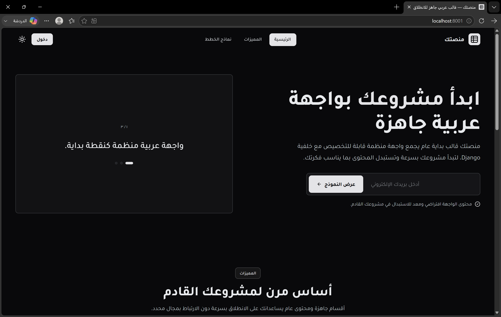
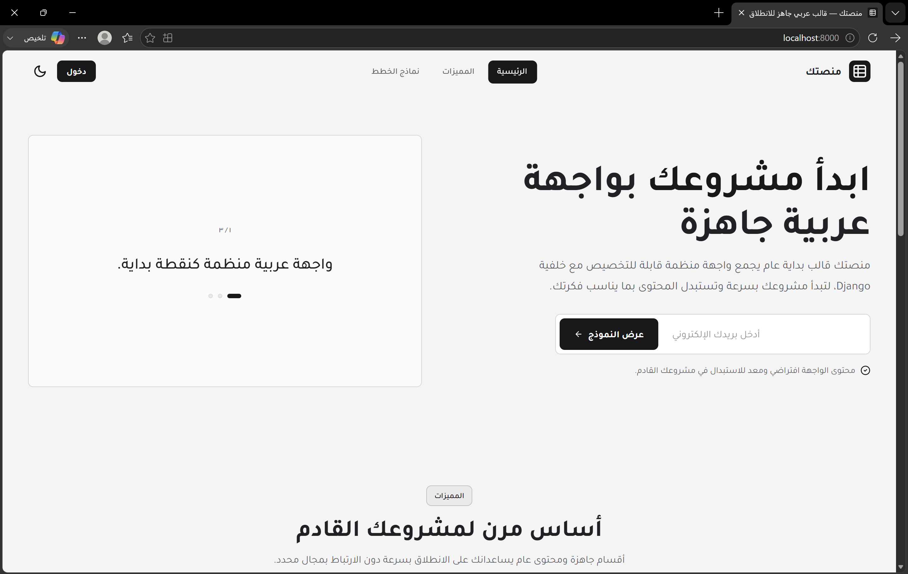

# django-static-starter-ar

Generic Arabic reusable starter template with a Django backend and a static
HTML/CSS/JavaScript frontend.

Latest release: **v0.1.4 — Optional Security Settings Hardening**.

The default frontend/site name is **"منصتك"**. The visible frontend copy is
generic placeholder content intended to be replaced by the user when starting a
real project. The template is not tied to any specific domain, product type, or
business model.

To start a new project from this template, see [the template usage guide](./docs/template-usage.md#starting-a-new-project-from-the-template).

For the current backend, frontend, and documentation layout, see [the project structure guide](./docs/template-usage.md#project-structure).

For environment file usage and current config behavior, see [the environment guide](./docs/environment.md).

For local setup and day-to-day development commands, see [the local development guide](./docs/local-development.md).

For the current backend API contract, see [the API guide](./docs/api.md).

For the starter-template readiness checklist, see [the template release checklist](./docs/template-release-checklist.md).

Project trust and release files:

- [`LICENSE`](./LICENSE)
- [`SECURITY.md`](./SECURITY.md)
- [`CHANGELOG.md`](./CHANGELOG.md)

## Frontend Template

The frontend is a flat, generic Arabic starter-template interface. It uses plain
HTML, CSS, and JavaScript: no frontend framework, no bundler, no build step, no
`package.json`, and no npm workflow.

The frontend content is intentionally generic placeholder copy. Replace the
brand, section text, navigation labels, and plan-card examples when creating a
real downstream project.

Highlights:

- **Generic-ready branding**. The default brand placeholder is "منصتك".
- **Reusable layout**. The current hero, feature cards, statistic strip,
  testimonial-style example cards, plan cards, help section, and footer remain
  as reusable starter sections.
- **Preserved visual baseline**. The interface keeps the existing flat visual
  style, compact spacing, solid surfaces, subtle borders, and Arabic RTL layout.
- **Dual-theme support**. `frontend/src/js/theme.js` initializes the theme, and
  the nav toggle switches between light and dark modes.
- **Static runtime config**. API endpoints and editable frontend copy live in
  `frontend/src/js/config.js`.
- **Generic SVG identity**. The logo and app icons are local SVG files under
  `frontend/public/assets/icons/`; no external image assets or icon libraries
  are required.

## Screenshots

### Dark mode



### Light mode



## Preview Locally

Serve the frontend from the repository root:

```powershell
.\.venv\Scripts\python.exe -m http.server 5173 --directory frontend
```

Then open:

```text
http://127.0.0.1:5173/
```

The frontend backend base URL currently lives in:

```text
frontend/src/js/config.js
```

Current default:

```js
BACKEND_API_BASE_URL: 'http://127.0.0.1:8000'
```

## Backend

The backend lives in `backend/` and uses Django.

Run the backend development server from the repository root:

```powershell
.\.venv\Scripts\python.exe backend\manage.py runserver 127.0.0.1:8000
```

Expected local backend URL:

```text
http://127.0.0.1:8000/
```

Current auth behavior uses Django sessions and cookies. The starter does not use
JWTs, frontend token storage, route guards, protected pages, or redirects.

Official backend endpoints are limited to:

- `GET /health/`
- `GET /api/health/`
- `GET /api/auth/csrf/`
- `POST /api/auth/register/`
- `POST /api/auth/login/`
- `GET /api/auth/me/`
- `POST /api/auth/logout/`

There is no official forgot-password or reset-password endpoint in the starter.

## Official Virtual Environment Workflow

The supported documented Python workflow uses the repository-root `.venv`.

```powershell
python -m venv .venv
.\.venv\Scripts\Activate.ps1
python -m pip install --upgrade pip
python -m pip install -r backend\requirements.txt
```

A separate virtual environment inside `backend/` is a local artifact if it exists
on a machine. It is not the documented supported workflow for this starter
template.

## Environment Files

`.env.example` is only an example. Local `.env` files are not loaded
automatically by the project.

No dependency is used to auto-load `.env` files. If you need environment values
locally, export supported variables yourself before running Django or introduce a
deliberate, documented change in a separate branch.

## Security Notes

The starter is development-friendly by default and is not production-safe out of
the box. Review [`SECURITY.md`](./SECURITY.md) before deploying a downstream
project.

## Information Architecture

| Nav label | Anchor | Content block |
| --- | --- | --- |
| الرئيسية | `#hero` | Hero + rotating showcase card |
| المميزات | `#features` | Feature cards |
| نماذج الخطط | `#pricing` | Placeholder plan-card examples |

Additional rendered sections include `#stats`, `#testimonials`, `#help`, the
final CTA, and the footer. These sections are generic starter-template examples
and can be renamed, hidden, or replaced downstream.

## Wiring A Backend

API config lives in `frontend/src/js/config.js`:

```js
window.APP_CONFIG = window.APP_CONFIG || {
  BACKEND_API_BASE_URL: 'http://127.0.0.1:8000',
  endpoints: {
    csrf: '/api/auth/csrf/',
    me: '/api/auth/me/',
    login: '/api/auth/login/',
    logout: '/api/auth/logout/',
    register: '/api/auth/register/',
  },
};
```

Showcase messages and visible page content live in the same file under
`window.APP_CONTENT`. Override config with script blocks injected before
`frontend/src/js/main.js`, or replace the static values in downstream projects.

## Standard Checks

Run backend checks from the repository root:

```powershell
.\.venv\Scripts\python.exe backend\manage.py check
.\.venv\Scripts\python.exe backend\manage.py test app
.\.venv\Scripts\python.exe -m unittest discover backend
.\.venv\Scripts\python.exe -m pip check
```

Run frontend syntax and HTML checks from the `frontend/` directory:

```powershell
node --check src\js\main.js
node --check src\js\config.js
npx --yes html-validate@9 "*.html" "partials/*.html"
```

`npx` is used only as an on-demand validation command. It does not add a
`package.json`, install a project dependency, or introduce an npm build workflow.
